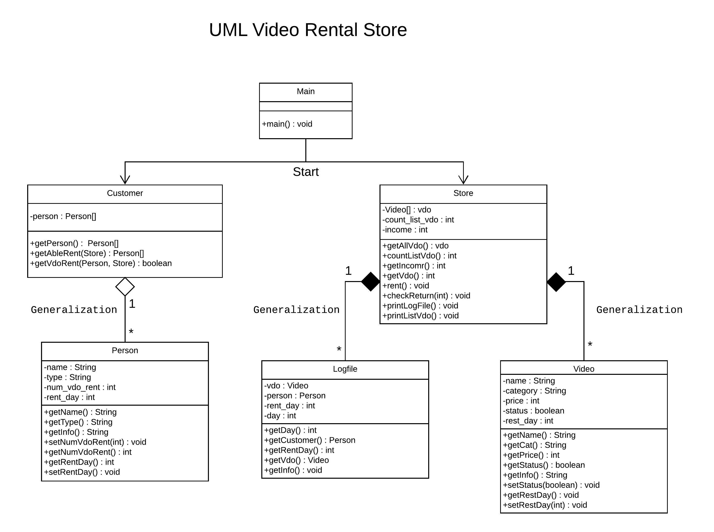

# เอกสารการใช้งานโปรแกรม

* UML

    

    ในโปรแกรมประกอบด้วย Class Main, Customer, Logfile, Person, Store และ Video โดยในการ compile และ run นั้นทำแค่กับ Class Main เพราะมันจะไปทำการ Start ส่วนที่เหลือให้เอง โดยจะทำทั้งหมด 35 วัน และในแต่ละวันจะมีการปริ้นข้อมูลของแต่ละวันออกมาดู

* Class Main

    ภายใน Class จะมีเพียง method main เพื่อสำหรับ run program โดยมันจะทำการสร้างการจำลองการยืมทั้งหมด 35 วัน และในแต่ละวันจะทำการ check การคืนของลูกค้าก่อนที่จะเริ่มการยืมในอีกวันหนึ่ง ซึ่งในแต่ละวันจะให้ลูกค้าทุกคนที่สามารถยืมได้มายืม หรือจนกว่าวีดีโอจะไม่พอแก่การยืม

* Class Customer

    ใน Class จะเป็นการเริ่มสร้างลูกค้าขึ้นมาจำนวน 10 คน Method ที่ใช้ก็จะเป็นการเลือกลูกค้าที่ยังสามารถยืมหนังได้ return กลับไป และการเช็คว่าคนๆนั้นสามารถยืมได้หรือไม่

* Class Person

    เป็น Class สำหรับของแต่ละคน โดยแต่ละคนจะมี ชื่อ ประเภทของคนๆนั้น และจำนวนวีดีโอที่คนนั้นได้ทำการยืมไป Method ก็จะเป็นการเรียกดูค่าและการเซ็ตจำนวนของวีดีโอที่ยืมไปของแต่ละคน

* Class Store

    Class นี้จะเป็นการสร้างวีดีโอขึ้นมาจำนวน 20 เรื่อง โดยจะมี Method ในการยืมวีดีโอและการคืนวีดีโอ รวมถึงที่ Method ใช้ในการสุ่มเลือกวีดีโอและวันให้กลับลูกค้านั้นๆ ซึ่งในแต่ละครั้งจะมีการทำประวัติเก็บไว้ภายใน Logfile

* Class Video

    เป็น Class ให้แก่วีดีโอแต่ละเรื่อง โดยจะมี ชื่อ, ประเภทของวีดีโอ, ราคา, จำนวนวันที่เหลือจากการเช่า และสถานะของวีดีโอนั้นในการยืม ซึ่งจะมี Method ในการเรียกดูสถานะและเซ็ตค่าของวันที่เหลือของวีดีโอนั้นๆ

* Class Logfile

    มีไว้สำหรับการบันทึกข้อมูลของแต่ละวัน โดยจะเก็บเป็น Object ของลูกค้าและวีดีโอของครั้งนั้นๆ และใช้ในการปริ้นข้อมูลของแต่ละวัน